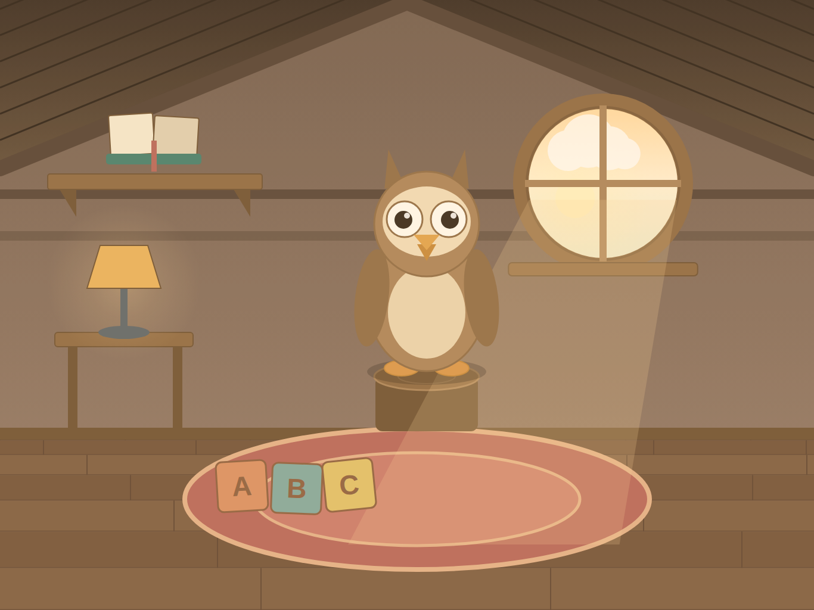

# Little Owl

An offline talking-companion app for iPad, for children aged 3–6. A cozy attic room
with a small owl who lives there: the child talks to the owl, and the owl talks back.
A digital toy, not a chatbot.

**Status: deliverable 2 of 8.** The room, the owl, the time-of-day window, and Echo —
the owl repeating what the child says in a sillier voice.

---

## Running it

Open `LittleOwl.xcodeproj` in Xcode 16 or later and run on an iPad simulator
(landscape). No packages to resolve, no scripts to run — there are no dependencies.

The committed project uses Xcode's synchronised folder groups, so new files under
`LittleOwl/` are picked up automatically and never need adding to a target. If the
project file ever conflicts in a merge, delete it and regenerate from `project.yml`:

```
brew install xcodegen && xcodegen generate
```

XcodeGen is a developer convenience and ships nothing into the app.

### Checking tap targets on device

```
Product → Scheme → Edit Scheme → Run → Arguments → add  -showTapTargets
```

Every tap target is drawn with its size **in real device points**, green at or above
88 × 88 pt and red below. This is how the toddler UX rule gets verified on hardware
rather than asserted in a comment.

---

## What is in the room

| Object | Mode | Deliverable |
|---|---|---|
| The owl itself | Echo | 2 |
| Open book on the shelf | Stories | 4 |
| Lamp on the side table | Prayers and rhymes | 5 |
| Letter blocks on the rug | Word games | 6 |
| Round window | "Why?" questions | 6 |

Echo works. The other four objects route correctly — tap one and the owl hops or flies
over and settles; tap the owl and it comes home — but those modes are not built yet.
`RoomScene.handle(_:)` is the single seam where each one attaches.

### Echo

Tap the owl and talk. The owl waits for you to finish, thinks for a beat, then says it
back six semitones higher and slightly quicker. Sometimes it giggles, before or after.

The turn ends when the child stops talking, when they tap the owl again, or at a
twelve-second cap. That is turn-taking, not a timeout — the child stays in Echo
throughout and can start another turn immediately.

**The recording never touches disk.** There is no file, no URL, no temporary directory:
the audio lives in one `AVAudioPCMBuffer` that is released the moment the owl finishes
speaking, or the moment anything is cancelled. See `VoiceRecorder` — it is a structural
property of that type, not a policy someone has to remember.

The microphone prompt appears on the **first tap of the owl** and nowhere else. If a
parent declines, or the microphone is unavailable, the owl giggles and carries on; the
child is never told anything and never sees anything to read.

Deciding when a child has stopped talking is the hard part. The constants in
`VoiceRecorder` are checked against synthetic rooms — quiet, noisy, a whisper, a child
who never stops:

```
python3 tools/simulate_turn_detection.py
```

## Previews

`docs/preview/` holds a render of the room at each time of day, generated from the
same layout constants the app uses:

```
python3 tools/preview_room.py                 # SVG
CHROME=/path/to/chromium tools/render_preview_png.sh   # SVG + PNG
```

Composition-accurate, finish-approximate: it does not simulate animation or
SpriteKit's blend modes. It exists so layout changes can be reviewed without a Mac.



---

## Layout of the code

```
LittleOwl/
  App/        SwiftUI entry point and the SpriteView host
  Room/       Scene, layout constants, props, the window, the time-of-day clock
  Owl/        Owl behaviour (OwlNode), the rig seam (OwlRig), the placeholder rig
  Audio/      Session policy, microphone permission, capture, pitched playback
  Modes/      Echo
  Support/    Palette, generated textures, sound effects, the tap-target overlay
  Resources/  Asset catalogue and placeholder sound effects
Config/       Info.plist
content/      Content packs (deliverable 3)
docs/         Art brief, decisions, previews
tools/        Placeholder-asset generators and the preview renderer
```

Two seams matter more than the rest:

- **`OwlRig`** separates what the owl *does* from how it is *drawn*. `PlaceholderOwlRig`
  draws vector shapes; a `RiveOwlRig` will drive a Rive state machine. Nothing above
  the protocol knows which is in use. See `docs/ART_BRIEF.md`.
- **`RoomScene.handle(_:)`** separates "a child touched something" from "a mode runs".
  Every mode attaches there and nowhere else.

## The rules this app is built under

These are load-bearing, not aspirational. Each one has a corresponding decision in the
code:

- **Fully offline.** No networking code, no `URLSession`, no analytics, no crash
  reporting, no remote config. `Config/Info.plist` documents the keys that must stay
  absent.
- **No third-party SDKs** except the animation runtime (Rive, arriving with the art).
- **No locks for the child.** No timers, no limits, no gates. The sleepy idle is
  decorative and wakes on any tap.
- **No text-based UI for the child.** Every action is a tap on an object. The letters
  on the toy blocks are decoration; the child is never asked to read.
- **Nothing is stored** except parent settings (deliverable 7). No history, no logs of
  anything the child said. Echo's recording is memory-only and short-lived.

## Deliverables

1. ~~Project skeleton, room, owl idle, time-of-day window~~
2. **Echo mode** ← you are here
3. Content pack schema and loader
4. Stories
5. Prayers and rhymes, with on-device recognition and the no-recognition fallback
6. Word games and "Why?"
7. Parent gate and settings
8. Kids-category checklist: privacy manifest, privacy policy, App Store metadata
