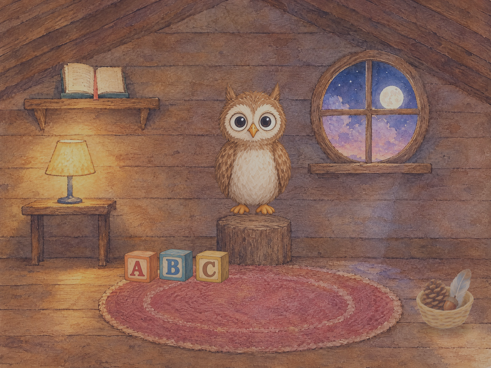

# Little Owl

An offline talking-companion app for iPad, for children aged 3–6. A cozy attic room
with a small owl who lives there: the child talks to the owl, and the owl talks back.
A digital toy, not a chatbot.

**Status: deliverable 3 of 8.** The attic room, an owl that blinks and moves its beak, a
window that follows the clock through four painted skies, Echo — and the content packs
every remaining mode will be built on.

---

## Running it

Open `LittleOwl.xcodeproj` in Xcode 16 or later and run on an iPad simulator
(landscape). No packages to resolve, no scripts to run — there are no dependencies.

The committed project uses Xcode's synchronised folder groups, so new files under
`LittleOwl/` are picked up automatically and never need adding to a target. If the
project file ever conflicts in a merge, delete it and regenerate from `project.yml`:

```
brew install xcodegen && xcodegen generate
```

XcodeGen is a developer convenience and ships nothing into the app.

### Checking tap targets on device

```
Product → Scheme → Edit Scheme → Run → Arguments → add  -showTapTargets
```

Every tap target is drawn with its size **in real device points**, green at or above
88 × 88 pt and red below. This is how the toddler UX rule gets verified on hardware
rather than asserted in a comment.

---

## What is in the room

| Object | Mode | Deliverable |
|---|---|---|
| The owl itself | Echo | 2 |
| Open book on the shelf | Stories | 4 |
| Lamp on the side table | Prayers and rhymes | 5 |
| Letter blocks on the rug | Word games | 6 |
| Round window | "Why?" questions | 6 |

Echo works. The other four objects route correctly — tap one and the owl hops or flies
over and settles; tap the owl and it comes home — but those modes are not built yet.
`RoomScene.handle(_:)` is the single seam where each one attaches.

### Echo

Tap the owl and talk. The owl waits for you to finish, thinks for a beat, then says it
back six semitones higher and slightly quicker. Sometimes it giggles, before or after.

The turn ends when the child stops talking, when they tap the owl again, or at a
twelve-second cap. That is turn-taking, not a timeout — the child stays in Echo
throughout and can start another turn immediately.

**The recording never touches disk.** There is no file, no URL, no temporary directory:
the audio lives in one `AVAudioPCMBuffer` that is released the moment the owl finishes
speaking, or the moment anything is cancelled. See `VoiceRecorder` — it is a structural
property of that type, not a policy someone has to remember.

The microphone prompt appears on the **first tap of the owl** and nowhere else. If a
parent declines, or the microphone is unavailable, the owl giggles and carries on; the
child is never told anything and never sees anything to read.

Deciding when a child has stopped talking is the hard part. The constants in
`VoiceRecorder` are checked against synthetic rooms — quiet, noisy, a whisper, a child
who never stops:

```
python3 tools/simulate_turn_detection.py
```

## The artwork

The room is a watercolour painting. `art-source/` holds the master layers as delivered;
`LittleOwl/Resources/Art/` holds the sprites the app ships, and they are **derived, not
hand-edited**:

```
pip install Pillow numpy
python3 tools/export_art.py      # art-source/ -> LittleOwl/Resources/Art/
```

That trims and normalises the cut-outs, downscales each sprite to twice the size it is
actually drawn at, and splits the window glass into a sky and the wooden muntins that
cross it — so the sky can follow the device clock behind unchanged woodwork.

Only three things are separate sprites: the window's sky, the three letter blocks, and
the owl. Everything else — shelf, book, lamp, table, stump, rug — is one painting, which
is why the book and the lamp answer a tap with a bloom of light rather than a squash.

`docs/preview/` is rendered from the app's own layout constants, so it cannot quietly
drift from what SpriteKit draws:

```
python3 tools/compose_room.py           # docs/preview/room-night.png
python3 tools/compose_room.py --grid    # plus the measuring grid and every tap target
```



The owl has seven painted frames and the window has four skies. How each is derived,
and what a replacement frame has to match, is in `docs/ART_BRIEF.md`.

---

## Content

Everything the owl says lives in `content/<language>/` as JSON, not in Swift, and
**nothing in the code names a language** — adding one is copying the folder and
translating it. Audio is matched by convention rather than by filename fields, so a
voice actor's delivery drops in without anybody editing JSON, and a line with no
recording falls back to the synthesiser **per line**, which is what makes a
half-recorded pack usable.

`content/README.md` is the format, the naming convention, and what is deliberately still
thin.

## Builds

Every push and pull request runs a **compile check and the unit tests** on a macOS runner
(`.github/workflows/build.yml`) — no secrets, no Apple account. It also verifies that
the shipped sprites still match what `tools/export_art.py` produces from `art-source/`,
so the two cannot silently diverge.

The tests cover the parts a wrong answer would quietly ruin: the content schema and the
shipped pack's self-consistency, the fuzzy matching that decides whether a
three-year-old's mumble counted, time-of-day bucketing, and the tap-target arithmetic.

A **TestFlight upload** (`.github/workflows/testflight.yml`) runs from the Actions tab or
on a `v*` tag. It needs four repository secrets and an Apple Developer account;
`docs/RELEASE.md` is the runbook.

## Layout of the code

```
LittleOwl/
  App/        SwiftUI entry point and the SpriteView host
  Room/       Scene, layout constants, props, the window, the time-of-day clock
  Owl/        Owl behaviour (OwlNode), the rig seam (OwlRig), the painted rig
  Audio/      Session policy, microphone permission, capture, playback, the owl's voice
  Content/    Content pack models, loader, and speech matching
  Modes/      Echo
LittleOwlTests/ Unit tests
content/      Content packs, one folder per language
  Support/    Palette, generated textures, sound effects, the tap-target overlay
  Resources/  Asset catalogue, painted art, placeholder sound effects, privacy manifest
art-source/   Master artwork as delivered by the painter
.github/      Build and TestFlight workflows
Config/       Info.plist
content/      Content packs (deliverable 3)
docs/         Art brief, decisions, previews
tools/        Placeholder-asset generators and the preview renderer
```

Two seams matter more than the rest:

- **`OwlRig`** separates what the owl *does* from how it is *drawn*. `WatercolourOwlRig`
  swaps painted frames and falls back to the base pose for any frame that has not been
  painted yet, so the owl gets livelier as art lands and no behaviour code changes. See
  `docs/ART_BRIEF.md`.
- **`RoomScene.handle(_:)`** separates "a child touched something" from "a mode runs".
  Every mode attaches there and nowhere else.

## The rules this app is built under

These are load-bearing, not aspirational. Each one has a corresponding decision in the
code:

- **Fully offline.** No networking code, no `URLSession`, no analytics, no crash
  reporting, no remote config. `Config/Info.plist` documents the keys that must stay
  absent.
- **No third-party SDKs** except the animation runtime (Rive, arriving with the art).
- **No locks for the child.** No timers, no limits, no gates. The sleepy idle is
  decorative and wakes on any tap.
- **No text-based UI for the child.** Every action is a tap on an object. The letters
  on the toy blocks are decoration; the child is never asked to read.
- **Nothing is stored** except parent settings (deliverable 7). No history, no logs of
  anything the child said. Echo's recording is memory-only and short-lived.

## Deliverables

1. ~~Project skeleton, room, owl idle, time-of-day window~~
2. ~~Echo mode~~
3. **Content pack schema and loader** ← you are here
4. Stories
5. Prayers and rhymes, with on-device recognition and the no-recognition fallback
6. Word games and "Why?"
7. Parent gate and settings
8. Kids-category checklist: privacy manifest, privacy policy, App Store metadata
